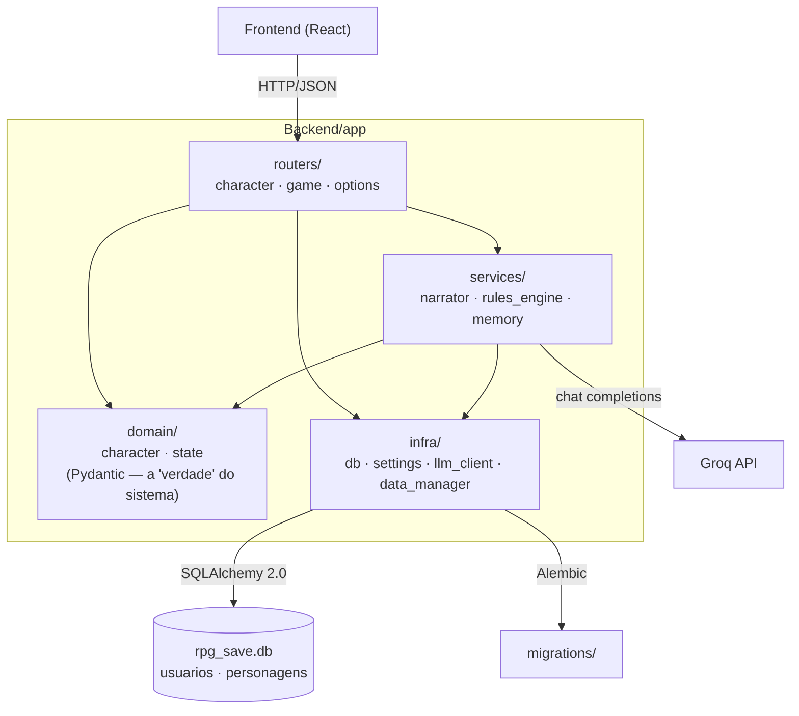

# Mestre.IA

[](https://github.com/Bobeda12/Mestre.IA/actions/workflows/ci.yml)

Um RPG narrado por um LLM — FastAPI + Groq no backend, React no front.

> A arquitetura, as decisões e o porquê de cada uma vivem em [`PLANO_MESTRE.md`](PLANO_MESTRE.md) e em [`docs/`](docs/). Este README é a porta de entrada de engenharia: como rodar, como o backend é organizado, e o que ele ainda não faz.

## Pré-requisitos

- [Python 3.11+](https://www.python.org/)
- [uv](https://docs.astral.sh/uv/getting-started/installation/) — `pip install uv`
- [Node.js 20+](https://nodejs.org/) com npm
- Uma chave da [Groq](https://console.groq.com/keys) (grátis) — opcional, ver abaixo
- [Docker](https://www.docker.com/) — opcional, só para o caminho `docker compose`

## Rodar (uv + npm)

Backend (num terminal):

```bash
cd Backend
cp .env.example .env   # cole sua GROQ_API_KEY, ou deixe em branco
uv sync
uv run alembic upgrade head   # cria/atualiza o schema em rpg_save.db
uv run uvicorn app.main:app --reload --port 8000
```

Frontend (em outro terminal):

```bash
cd Frontend
npm install
npm run dev
```

Abra `http://localhost:5173`.

**Sem chave da Groq:** o jogo ainda sobe e a criação de personagem funciona — ela cai num prólogo de fallback pré-escrito (`app/services/narrator.py`) em vez de gerar um com IA. O chat responde com uma mensagem explicando que falta a chave, em vez de tentar narrar. É suficiente para navegar a interface; não é suficiente para jogar de verdade.

Se tiver [`just`](https://github.com/casey/just) instalado, `just backend-dev` já encadeia `uv sync` + `alembic upgrade head` + `uvicorn`, e `just frontend-dev` sobe o front (veja o [`justfile`](justfile) para a lista completa).

## Rodar (Docker)

```bash
docker compose up --build
```

Sobe o backend (porta 8000, migration aplicada automaticamente no entrypoint) e o front (porta 5173, build de produção servido estático). Precisa de `Backend/.env` já existir (copie de `.env.example`). Caminho de dev/local — hospedagem de verdade (Postgres, Fly.io) é escopo da Etapa 9.

## Testar

```bash
cd Backend
uv run ruff check .              # lint
uv run mypy app                  # tipos
uv run pytest -v --cov=app/domain --cov=app/services --cov-report=term-missing
```

O CI (`.github/workflows/ci.yml`) roda essas três etapas em sequência a cada push/PR, com um gate: o PR não passa se a cobertura de `app/domain` + `app/services` cair abaixo de 60%.

## Arquitetura do backend

Desde a Etapa 2, `Backend/api.py` (um arquivo de 291 linhas fazendo tudo) virou um pacote em camadas:



- **`routers/`** — só HTTP: parseia a requisição (via os modelos de `domain/`), chama um `service`, devolve a resposta. Não sabe nada sobre regras de D&D nem sobre o LLM.
- **`services/`** — a lógica: `narrator.py` fala com a Groq (e sabe transformar cada tipo de falha numa mensagem própria), `rules_engine.py` é determinístico (zero I/O, zero LLM — modificador de atributo, rolagem de dado, point-buy), `memory.py` hoje só recorta as últimas N mensagens (a base da memória em camadas da Etapa 5).
- **`domain/`** — os modelos Pydantic que definem a forma do estado do jogo: o que o cliente pode propor na criação de personagem (`character.py`) e como `world_state`/`combat_state`/`quest_log` são tipados (`state.py`), em vez de dicionários soltos.
- **`infra/`** — tudo que fala com o mundo externo: banco (SQLAlchemy 2.0 tipado), config (`pydantic-settings`, lendo `.env`), o client da Groq, e o carregador dos JSONs de regras (`data/`).

Ver [`ADR-0003`](docs/adr/0003-camadas-router-service-domain-infra.md) para o porquê dessa divisão, [`ADR-0004`](docs/adr/0004-alembic-para-migrations.md) para as migrations, e [`ADR-0005`](docs/adr/0005-usuario-personagem-antes-do-login.md) para o par `usuario`/`personagem` no schema.

## Limitações conhecidas

Honestas de propósito — ver `PLANO_MESTRE.md` §2.2 para o diagnóstico completo e as etapas que fecham cada uma:

- **Não existe login de verdade.** Todo personagem pertence a um único `usuario` local fixo (id 1), criado no startup. O schema já suporta múltiplos usuários (Etapa 2); a autenticação por e-mail mágico chega na Etapa 8.
- **O combate não é determinístico.** `spawn_battle` cria um inimigo genérico (`hp: 10`); não há dano real, iniciativa, nem fim de combate. O motor de regras de verdade é a Etapa 3 ("O Juiz").
- **HP não muda em jogo.** O modelo pode narrar dano, mas ninguém grava. Mesma etapa acima.
- **A memória do mestre é curta.** Só as últimas 4 mensagens (`services/memory.py`). Memória hierárquica (curto/médio/longo prazo, busca híbrida) é a Etapa 5.
- **`rolar_dado()` engole entrada inválida e devolve 0 em silêncio.** Correção proposital adiada para a Etapa 3 — ver o teste que caracteriza esse comportamento em `tests/test_rules_engine.py`.
- **Um único herói, sem mesa multiplayer** — decisão de escopo deliberada (`PLANO_MESTRE.md` §9.3), não uma limitação a corrigir.
- **CORS aberto (`*`) e sem rate limit.** Aceitável em dev; fechar isso é Etapa 9 (deploy).

## Estrutura

```
Backend/
  app/            código em camadas (routers, services, domain, infra) — ver acima
  migrations/     Alembic
  data/           JSONs de regras (raças, classes, monstros, armas) + a bíblia do mestre
  tests/          pytest
Frontend/         React + TypeScript + Vite + Tailwind
docs/             decisões (ADR), diário de progresso — ver docs/README.md
aprender/         lições sobre o próprio código, para quem escreveu o projeto
```
